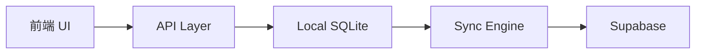

# 本地数据库集成与异步同步

> 变更日期：2026-01-28

## 架构概览

实现了 **Local-First** 架构，所有读写操作优先使用本地 SQLite 数据库，异步同步到 Supabase。



---

## 新增文件

| 文件 | 说明 |
|------|------|
| `src-tauri/migrations/001_init.sql` | SQLite 数据库 Schema |
| `src/db/local.ts` | 数据库连接管理 |
| `src/db/localTodos.ts` | Todos 本地 CRUD |
| `src/db/localPomodoro.ts` | Pomodoro 本地 CRUD |
| `src/sync/SyncEngine.ts` | 同步核心逻辑 |
| `src/sync/SyncQueue.ts` | 同步队列管理 |
| `src/sync/ConflictResolver.ts` | 冲突检测与解决 |
| `src/api/sync.ts` | 同步操作 API |

---

## 修改的文件

| 文件 | 变更 |
|------|------|
| `src-tauri/Cargo.toml` | 添加 `tauri-plugin-sql` |
| `package.json` | 添加 `@tauri-apps/plugin-sql` |
| `src-tauri/src/lib.rs` | 注册 SQL 插件和迁移 |
| `src-tauri/capabilities/default.json` | 添加 SQL 权限 |
| `src/api/todos.ts` | 重构为本地优先 |
| `src/api/pomodoro.ts` | 重构为本地优先 |
| `src/api/auth.ts` | 添加离线会话缓存 |
| `src/auth/AuthGuard.tsx` | 集成同步引擎初始化 |

---

## 核心功能

### 离线模式
- 使用 `navigator.onLine` 检测网络状态
- 离线时使用 `localStorage` 缓存的用户信息
- Tauri v2 环境检测：`__TAURI_INTERNALS__`

### 同步机制
1. **写操作**：数据写入本地 SQLite，设置 `sync_status = 'pending'`
2. **后台同步**（每 30 秒）：Push pending → Pull updates
3. **冲突解决**：Last Write Wins（基于 `updated_at` 时间戳）

---

## SQL 权限配置

```json
"permissions": [
  "sql:default",
  "sql:allow-execute",
  "sql:allow-select",
  "sql:allow-load",
  "sql:allow-close"
]
```
