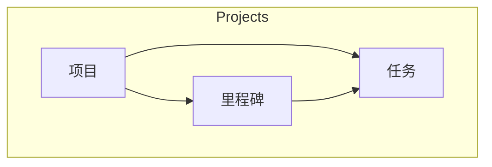
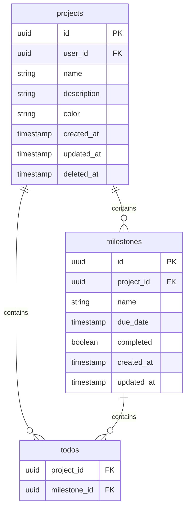

# 项目管理模块

> 变更日期：2026-01-28

## 功能概述

新增 **Projects** 入口用于项目管理，与 Todos/Calendar 同级。支持创建项目、设置里程碑，并可将已有任务关联到项目/里程碑。



---

## 数据模型



---

## 新增文件

| 文件 | 说明 |
|------|------|
| `supabase/migrations/005_projects.sql` | Supabase 项目表 Schema |
| `src-tauri/migrations/002_projects.sql` | SQLite 项目表 Schema |
| `src/api/projects.ts` | 项目 API（Local-First） |
| `src/db/localProjects.ts` | 项目本地 CRUD |
| `src/projects/ProjectsPage.tsx` | 项目页面组件 |

---

## 修改的文件

| 文件 | 变更 |
|------|------|
| `src/App.tsx` | 添加 `/projects` 路由 |
| `src/components/Layout.tsx` | 添加 Projects 导航图标 |
| `src/api/todos.ts` | 添加 `project_id`, `milestone_id` 字段 |
| `src/todos/TodosPage.tsx` | 任务详情添加项目/里程碑选择器 |

---

## UI 设计

### 布局结构

```
┌──────────┬─────────────────┬─────────────────┐
│          │                 │                 │
│  导航栏   │    项目卡片列表   │    项目详情     │
│          │                 │                 │
│  Todos   │  ┌─────────────┐│  项目名称       │
│  四象限   │  │ 项目 A      ││  描述          │
│  日历     │  │ 3 任务 ●    ││                │
│ >项目     │  └─────────────┘│  ─ 里程碑 ─    │
│  番茄钟   │  ┌─────────────┐│  M1: 设计      │
│  设置     │  │ 项目 B      ││  M2: 开发      │
│          │  │ 5 任务 ●    ││                │
│          │  └─────────────┘│  ─ 任务列表 ─   │
│          │                 │  Task 1        │
│          │                 │  Task 2        │
└──────────┴─────────────────┴─────────────────┘
```

### 卡片设计

- 渐变色背景 + 玻璃态效果
- 悬停动画（scale + shadow）
- 进度指示器（完成任务数/总任务数）
- 颜色标识（用户可选）

---

## API 接口

### Projects

| 函数 | 说明 |
|------|------|
| `fetchProjects(userId)` | 获取用户所有项目 |
| `createProject(userId, data)` | 创建项目 |
| `updateProject(id, patch)` | 更新项目 |
| `deleteProject(id)` | 软删除项目 |

### Milestones

| 函数 | 说明 |
|------|------|
| `fetchMilestones(projectId)` | 获取项目里程碑 |
| `createMilestone(projectId, data)` | 创建里程碑 |
| `updateMilestone(id, patch)` | 更新里程碑 |
| `deleteMilestone(id)` | 删除里程碑 |
